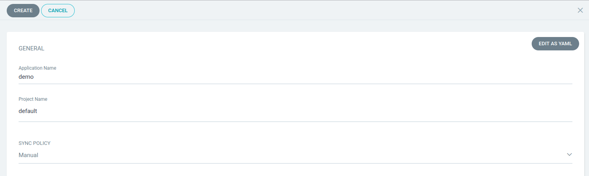
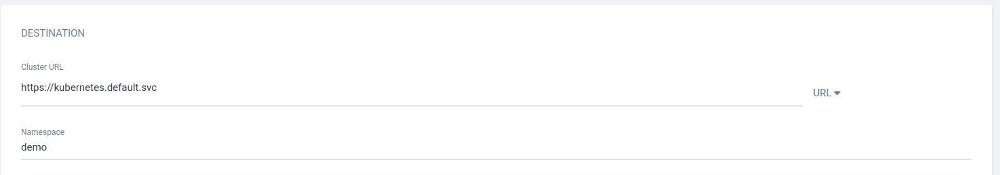
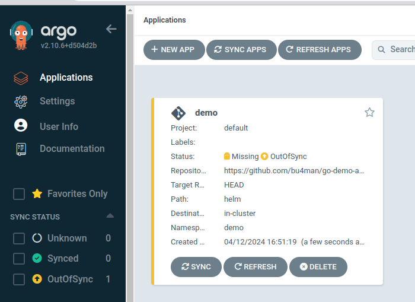
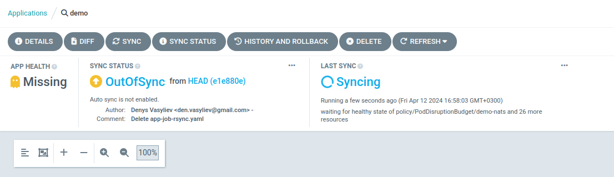
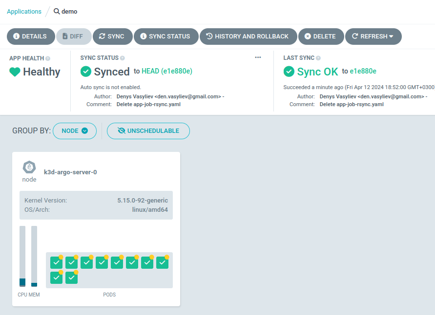
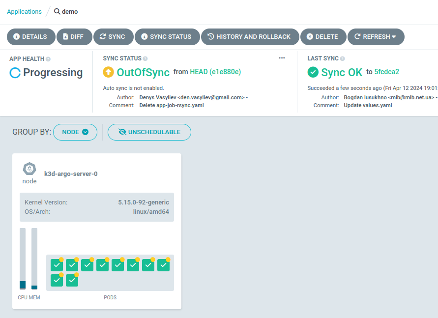

# AsciiArtify PoC demo

This document describes details how to deploy ArgoCD and get access to it.

## Installation

1. Create local Kubernetes cluster 
```bash
$ k3d cluster create argo 
...
INFO[0014] Cluster 'argo' created successfully!         
INFO[0014] You can now use it like this:                
kubectl cluster-info

$ kubectl cluster-info 
Kubernetes control plane is running at https://0.0.0.0:43003
CoreDNS is running at https://0.0.0.0:43003/api/v1/namespaces/kube-system/services/kube-dns:dns/proxy
Metrics-server is running at https://0.0.0.0:43003/api/v1/namespaces/kube-system/services/https:metrics-server:https/proxy

To further debug and diagnose cluster problems, use 'kubectl cluster-info dump'.
$ alias k=kubectl
$ source <(kubectl completion bash|sed s/kubectl/k/g)
$ k version
$ k get all -A
```

2. Create separate namespace for ArgoCD and install it there
```bash
$ k create namespace argocd  
namespace/argocd created
$ k get ns
NAME              STATUS   AGE
default           Active   4m58s
kube-system       Active   4m58s
kube-public       Active   4m58s
kube-node-lease   Active   4m58s
argocd            Active   1s

$ k apply -n argocd -f https://raw.githubusercontent.com/argoproj/argo-cd/stable/manifests/install.yaml
$ k get all -n argocd
....
$ k get pod -n argocd -w
NAME                                               READY   STATUS    RESTARTS   AGE
argocd-redis-69f8795dbd-62skg                      1/1     Running   0          39s
argocd-notifications-controller-7f8d9dd7f-s6tlk    1/1     Running   0          39s
argocd-applicationset-controller-79c95f5d7-24z9g   1/1     Running   0          39s
argocd-dex-server-f5d97b5b-kpsbb                   1/1     Running   0          39s
argocd-repo-server-9cf5d5585-642pf                 1/1     Running   0          39s
argocd-application-controller-0                    1/1     Running   0          39s
argocd-server-7574cff9df-xq8n7                     1/1     Running   0          39s


```

3. Setup web access to ArgoCD GUI.

This can be done in various ways:
- Service type load balancer
- Ingress
- Port Forwarding

Let's use Port Forwarding as simplest way. Commands are:
```bash
$ k port-forward svc/argocd-server -n argocd 8080:443&
[1] 2256779
Forwarding from 127.0.0.1:8080 -> 8080
Forwarding from [::1]:8080 -> 8080

```

Now you can use any browser to access [GUI](https://127.0.0.1:8080)
> Hint: Please accept self-signed certificate

4. Time to get user/password details

Secret file is `argocd-initial-admin-secret` and password is ecrypted there with base64:
```bash
$ k -n argocd get secret argocd-initial-admin-secret -o jsonpath="{.data.password}"
UGt0REhWRm1nelhMbngyMg==

$ k -n argocd get secret argocd-initial-admin-secret -o jsonpath="{.data.password}"|base64 -d;echo
PktDHVFmgzXLnx22
```

Now you have user `admin` and password `PktDHVFmgzXLnx22`, so use them to access.

5. Create new application using GUI:
- click `+ NEW APP`
- Type applicaiton name as `demo`
- Select `default` as Project name
- Keep `Manual` as Sync Policy




<IMG1>

- Under SOURCE keep GIT and provide URL as [https://github.com/bu4man/go-demo-app](https://github.com/bu4man/go-demo-app)
- Set Path as `helm` (choose from dropdown)


- Under Destination select `Cluster URL` from drop-down list and type `demo` in Namespace field




- Sroll up to `Sync policy` section and set checkbox `AUTO-CREATE NAMESPACE`


- Click `Create` button



6. Now click on `demo` name of newly created application to see details about components

7. Sync the application

- Click on `Sync` button in application details page
- new window will appear where you can select which components and mode to be used. Click `Synchronize`



- once done, status will be seen in GUI




8. Let's do some changes in repo and sync again

- Edit file [values.yaml](https://github.com/bu4man/go-demo-app/blob/master/helm/values.yaml)
- Change there `type` from nodePort to LoadBalancer in `api-gateway` section
- Check current type using below command:

```bash
$ k get svc -n demo
NAME               TYPE        CLUSTER-IP      EXTERNAL-IP   PORT(S)                                                 AGE
demo-nats          ClusterIP   None            <none>        4222/TCP,6222/TCP,8222/TCP,7777/TCP,7422/TCP,7522/TCP   7m42s
demo-img           ClusterIP   10.43.170.221   <none>        80/TCP                                                  7m42s
demo-data          ClusterIP   10.43.29.143    <none>        80/TCP                                                  7m42s
cache              ClusterIP   10.43.71.71     <none>        6379/TCP                                                7m42s
demo-front         ClusterIP   10.43.246.67    <none>        80/TCP                                                  7m42s
ambassador         NodePort    10.43.99.103    <none>        80:31134/TCP                                            7m42s
ambassador-admin   ClusterIP   10.43.32.234    <none>        8877/TCP                                                7m42s
demo-ascii         ClusterIP   10.43.229.238   <none>        80/TCP                                                  7m42s
db                 ClusterIP   10.43.17.49     <none>        3306/TCP                                                7m42s
demo-api           ClusterIP   10.43.149.92    <none>        80/TCP                                                  7m42s
```
- Do Sync in GUI



- check new type using the same command

```bash
$ k get svc -n demo
NAME               TYPE           CLUSTER-IP      EXTERNAL-IP   PORT(S)                                                 AGE
....
ambassador         LoadBalancer   10.43.99.103    <pending>     80:31134/TCP                                            10m
```